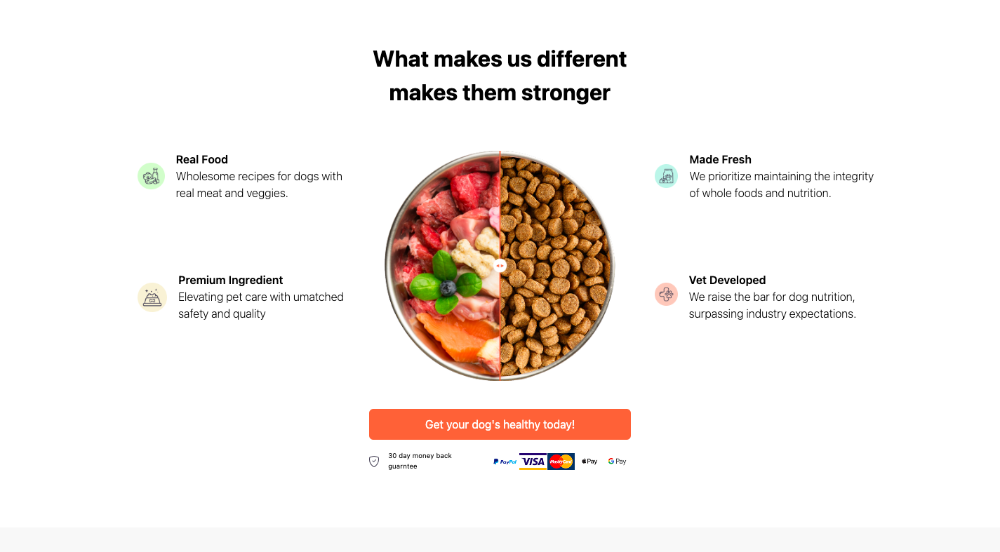

# Home Page - GemCommerce Test

The project is a Homepage built as part of the GemCommerce Customer Success assessment. It follows the provided Figma design and includes responsive behaviour, clean UI and efficient code structure.

## Table of contents

- [Screenshot](#screenshot)
- [Features](#features)
- [Tech Stack](#tech-stack)
- [Link](#link)
- [How to run (local)](#how-to-run)

## Screenshot


<br/>
<br/>

## Features

- Responsive Layout
- Reuseable components
- Clean and maintainable folder structure
- Smooth user interface with thoughtful interactions
- Added Favicon

## Tech stack

- React.js (Vite)
- Tailwind CSS

## Link

- Live Demo : [Demo](https://gemtalent.netlify.app)

## 📦 How to run

1. Clone the repository:

   ```sh
   git clone https://github.com/Jacbfrancis/Gem-Talents-Test.git

   ```

2. Navigate to the project folder:

   ```sh
   cd Gem-Talents-Test

   ```

3. Install dependencies:

   ```sh
   npm install

   ```

4. Start the development server:

   ```sh
   npm run dev

   ```
